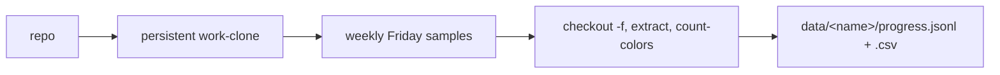

# verification-progress-history

Reconstruct a formal-verification project's **progress over git history** as a
burn-up time series. The tool samples one commit per period (default: weekly,
the last commit on/before each Friday), checks each out in a persistent
work-clone, runs the matching probe `extract` (which runs the real verifier),
and records the full colour/progress metric set to a JSONL file (one record per
sampled commit, upserted in place so a `--retry-failed` re-run supersedes the
prior row rather than duplicating it) plus a regenerated CSV.

The metrics and the chart they feed are defined in the VeriLib engineering docs:
[Atom statuses and colours](https://docs.verilib.org/components/processor/atom-statuses-and-colours/)
(section "Progress chart (burn-up over time)"): the curves are
`tracked ≥ (verified + trusted) ≥ verified`, with `translated` as an
Aeneas-only intermediate line.

This is a **standalone CLI** (Python 3 stdlib only), not a GitHub Action: a
multi-hour history walk with per-commit toolchain installs and cross-commit
build caches is a poor fit for CI.

## Files

| File | Purpose |
|------|---------|
| `progress_history.py` | The CLI: sampling, checkout, extract orchestration, output. |
| `colors.py` | Port of the `count-colors` reference logic; computes the metric record from one extract JSON. Runnable standalone for parity checks. |
| `plot_progress.py` | Renders the burn-up chart from the JSONL/CSV to a self-contained SVG (stdlib only). |

## Requirements

- Python 3.10+ (stdlib only).
- `git`.
- The probe binaries for your pipeline on `PATH` (pinned to one version for the whole run):
  - Verus projects: [`probe-verus`](https://github.com/Beneficial-AI-Foundation/probe-verus) (installs `verus-analyzer`, `scip`, and the matching Verus via `probe-verus setup --from-project`).
  - Aeneas projects: [`probe-aeneas`](https://github.com/Beneficial-AI-Foundation/probe-aeneas) (+ `elan` for the Lean toolchain; runs Charon + `lake build`).

## How it works

1. **Clone once** into a persistent `--work-clone` (never touches your checkout; a local path is cloned so build caches accumulate there).
2. **List commits** in `--since`/`--until` and **bucket** them by period, keeping the latest commit per period. Weeks with no commit are gaps (not interpolated); HEAD is always included.
3. **Oldest → newest**, for each sample: `git checkout -f <sha>` (never `git clean -x`, so `target/` / `.lake/` caches survive and each build is incremental), run `extract`, then read the **freshly written** unified JSON and validate its `source.commit` matches the sample before recording.
   - **Verus**: the matching Verus release is installed per commit via `probe-verus setup --from-project` (deduped — only re-installs when the pinned release changes).
   - **Lean/Aeneas**: when the `lean-toolchain` changes between samples, the tool runs `lake clean` + `lake exe cache get` first, because `.olean` from another Lean version fail to import ("stale .olean"). This is tracked by an on-disk sentinel so it also fires correctly on `--retry-failed`.
4. **Append** one record per sample to JSONL and regenerate the CSV. Failures (build/verify/timeout/mismatch) are recorded with a status + reason, not dropped.



## Usage

```
progress_history.py <repo> [options]
```

Key options: `--pipeline {auto,verus,aeneas,lean}`, `--project-subdir`,
`--package`, `--since`, `--until`, `--branch` (default `origin/HEAD`),
`--cadence {weekly,biweekly,monthly}` (or `--cadence-weeks N` for a coarser
period), `--anchor-day`, `--work-clone`, `--output`, `--csv`,
`--sample-timeout`, `--resume` (+ `--retry-failed`), `--smt-seed`,
`--skip-verify`, `--dry-run`.

Use `--dry-run` first to see exactly which commits will be sampled.

### Determinism and cost

- **Verus** counts are pinned to `--smt-seed 0` (forwarded as
  `--verus-args --smt-option smt.random_seed=0`) for reproducibility.
- One **pinned** probe version runs at every sample. Old commits the current
  probe cannot parse/verify are recorded as `failed` (a visible gap), not fatal.
- Runs are **long** (each sample re-verifies). Run one repo at a time, in the
  background, and re-invoke with `--resume` to continue.

## Run guide (active targets)

Both are expensive; run `--dry-run` first, then drop it to execute. Output lands
in `../../data/<name>/progress.jsonl` (+ `.csv`) by default, one folder per repo.

### dalek-verus (Verus)

```bash
python3 progress_history.py /path/to/dalek-verus \
  --pipeline verus \
  --project-subdir curve25519-dalek --package curve25519-dalek \
  --since 2025-07-14 \
  --work-clone /tmp/vph-dalek-verus \
  --sample-timeout 7200 --resume
```

Note: dalek-verus **tracks** `.verilib/probes/*.json`; `git checkout -f` restores
the committed copy each sample and our fresh extract overwrites it, so we always
read the freshly written file (validated by `source.commit`).

### SparsePostQuantumRatchet-verify (Aeneas)

```bash
python3 progress_history.py /path/to/SparsePostQuantumRatchet-verify \
  --pipeline aeneas \
  --since 2026-03-13 \
  --work-clone /tmp/vph-spqr \
  --sample-timeout 3600 --resume
```

`--sample-timeout` bounds each sample and the tool kills the whole process
group, recording a `timeout` status. SPQR only commits a `translation.json`
from mid-2026 (PR #197), so earlier samples regenerate it via Charon (heavier);
recent samples with a committed `translation.json` skip the Charon pre-flight.
The `lean-toolchain` changes across this window, so the tool cleans the Lean
build on each change (see step 3).

### curve25519-dalek-lean-verify (Aeneas / "dalek-lean")

```bash
python3 progress_history.py /path/to/curve25519-dalek-lean-verify \
  --pipeline aeneas \
  --since 2026-03-11 \
  --cadence monthly \
  --work-clone /tmp/vph-dalek-lean \
  --sample-timeout 3600 --resume
```

Reachability is bounded on **both** ends of the early history, so `--since`
matters:
- probe-lean needs Lean ≥ v4.28.0-rc1 (`.olean` are version-specific); dalek-lean
  crossed that floor on **2026-02-23**, so earlier commits are unbuildable.
- `probe-aeneas extract` needs `aeneas-config.yml`, first committed **2026-03-11**
  — the practical start date above.

This repo has **no** `translation.json`, so every sample runs the heavier Charon
pre-flight (there is no manifest to read def-ids from). The `lean-toolchain`
changes across the window, so the tool cleans the Lean build on each change (see
step 3).

## Output record

One JSON object per sample (JSONL); the CSV has the same columns:

`repo, pipeline, sample_date, commit, commit_date, tool, tool_version, status,
reason, commit_validated, duration_sec, grey, white, red, yellow, light_green,
dark_green, purple, exec_total, dot_red, dot_yellow, dot_green, art_total,
tracked, verified, verified_trusted, translated`

`status` is one of `ok`, `setup_failed`, `checkout_failed`, `extract_failed`,
`verify_error`, `timeout`, `commit_mismatch`. `verify_error` means extract wrote
a valid JSON but the verifier produced no per-function statuses (a build /
toolchain error at that commit) — a visible gap, distinct from a real
"0 verified" point. Only `ok` samples are charted.

## Plotting

`plot_progress.py` turns a progress file into a self-contained burn-up SVG
(stdlib only), rendering the frontiers defined in the doc:

```bash
# Burn-up: tracked >= (verified + trusted) >= verified  (+ translated for Aeneas)
python3 plot_progress.py ../../data/dalek-verus/progress.jsonl \
  -o ../../data/dalek-verus/burnup.svg
```

It reads either `.jsonl` or `.csv`, plots only `ok` samples (gaps are omitted
and noted in the caption), and auto-adds the `translated` line for Aeneas data.
The curves are not guaranteed monotonic (refactors/renames can drop counts).

### Status curves (`--in-progress`, `--unspecified`)

By default the gap between the completion frontier and the ceiling is left
implicit. Two flags add the doc's atom-status counts as their own curves — and
they are **distinct states**, not the same "unverified" bucket:

- `--in-progress` draws `yellow`: atoms with an **incomplete proof** (`sorry` /
  `assume`) — the doc's actual "in-progress" status. This is the real WIP proof
  debt; watch it fall as proofs land.
- `--unspecified` draws `white`: atoms **tracked but with no spec written yet**
  (never attempted). Watch it fall as specs are added.

```bash
python3 plot_progress.py ../../data/SparsePostQuantumRatchet-verify/progress.jsonl \
  --in-progress --unspecified --png \
  -o ../../data/SparsePostQuantumRatchet-verify/burnup-inprogress.svg
```

Do **not** read `tracked - verified` as the `sorry` count: it is
`white + yellow + red`, so it conflates not-yet-specified functions with
in-progress proofs. And even `yellow` (per-atom) is not the raw `sorry` token
count in the Lean sources — one unproven lemma can leave many downstream atoms
`unverified`. See `colors.py` for the full status model.

### PNG output (`--png`)

`--png` also writes a PNG next to the SVG by shelling out to the first available
rasterizer (`rsvg-convert`, then `inkscape`, then ImageMagick `convert`); if
none is on `PATH` it prints a hint and writes the SVG only. `--png-scale`
(default `2.0`) sets the raster scale for crisp output.

## Parity check

`colors.py <extract.json> --table` reproduces the reference `count-colors`
output for any probe extract JSON, so you can confirm the metric logic against a
known snapshot.
